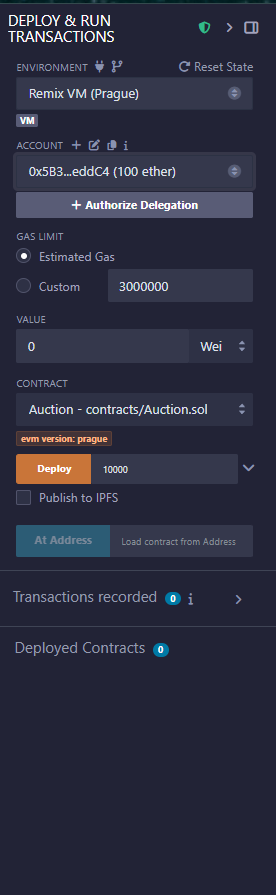
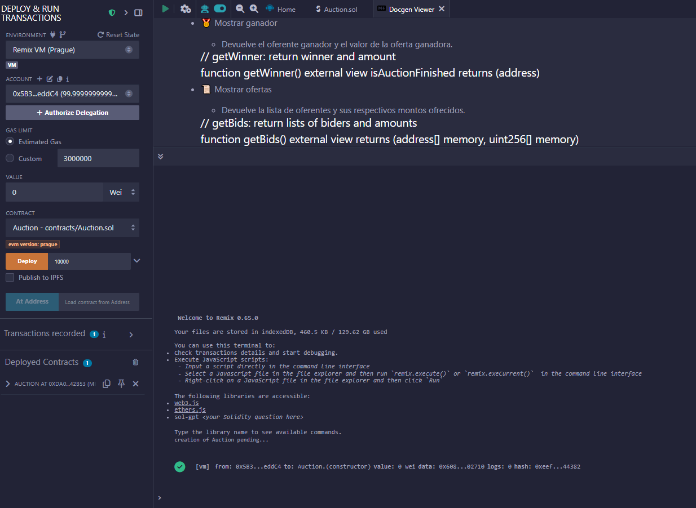
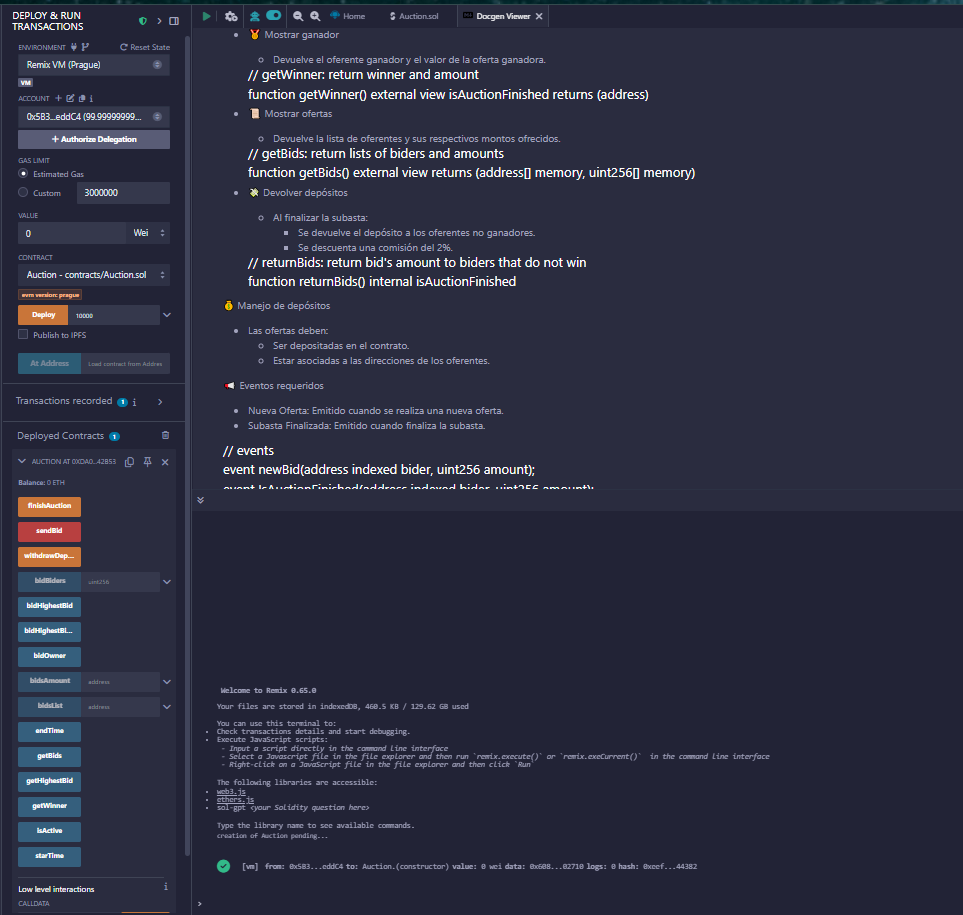
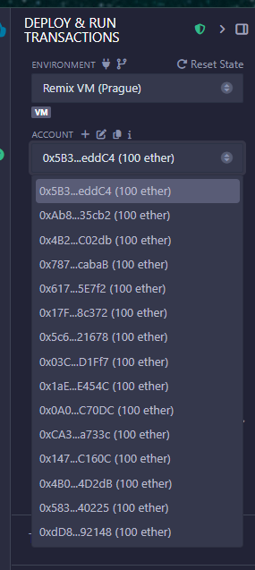

Test del contrato

Realizaremos un test siguiendo estos pasos:
0- estqado inicial

1- creacion del contrato,
    owner:    0x5B38Da6a701c568545dCfcB03FcB875f56beddC4

2- ofertas validas (address, $)
    address:    0xAb8483F64d9C6d1EcF9b849Ae677dD3315835cb2      100
    address:    0x4B20993Bc481177ec7E8f571ceCaE8A9e22C02db      120
    address:    0x78731D3Ca6b7E34aC0F824c42a7cC18A495cabaB      121

3- oferta menor que maximo, la rechaza
    address:    0x617F2E2fD72FD9D5503197092aC168c91465E7f2      120

4- oferta mayor que maximo, la acepta
    address:    0x17F6AD8Ef982297579C203069C1DbfFE4348c372      150

5- pruebas de funciones
5.1

5.2

5.3

5.4

5.5

6- finalizar la Subasta

